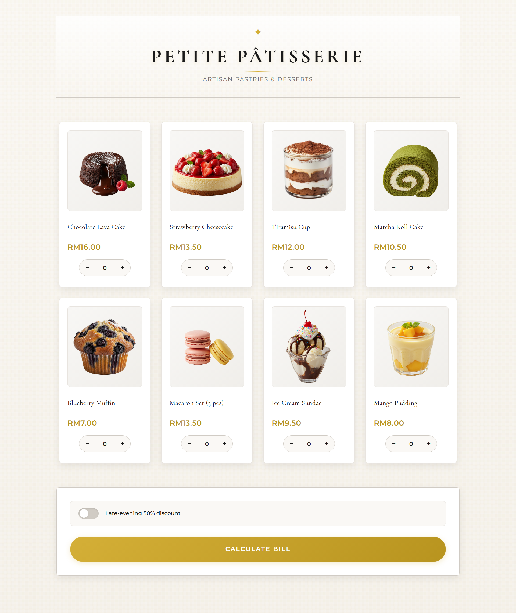
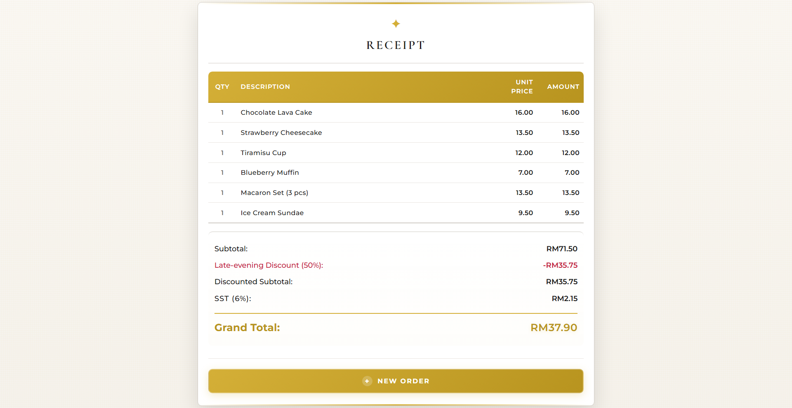

## Description of Web Application
A web-based dessert ordering system for "Petite Pâtisserie" that allows cashier to select desserts from the menu and add them to the cart. The application displays the selected items with quantities and calculates the total amount to pay, generating a receipt for the cashier.

### Interface of [index.php](web%20application/index.php)

### Interface of [receipt.php](web%20application/receipt.php)

